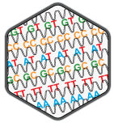

[](https://f1000research.com/articles/10-141)
[](https://doi.org/10.1101/gr.265934.120)
[](https://www.bioconductor.org/packages/periodicDNA)
[](https://www.tidyverse.org/lifecycle/#production)
[](https://github.com/js2264/periodicDNA)
[](https://www.gnu.org/licenses/gpl-3.0.en.html)

# periodicDNA 


## Introduction

This R package helps the user identify k-mers (e.g. di- or 
tri-nucleotides) present periodically in a set of genomic loci (typically 
regulatory elements). It is not aimed at identifying motifs separated by a 
conserved distance; for this type of analysis, please visit 
[MEME](http://meme-suite.org) website.

## Installation

periodicDNA is available in Bioconductor. To install the current release use:

```r
if (!requireNamespace("BiocManager", quietly = TRUE))
    install.packages("BiocManager")
BiocManager::install("periodicDNA")
```

For advanced users, the most recent periodicDNA can be installed 
from Github as follows (might be buggy):

```r
install.packages("devtools")
devtools::install_github("js2264/periodicDNA")
library(periodicDNA)
```

## Citation

If you are using periodicDNA in your research, please cite: 

> [periodicDNA: an R/Bioconductor package to investigate k-mer periodicity in DNA](https://f1000research.com/articles/10-141)
> **J. Serizay** & J. Ahringer  
> F1000Research, 2021

> [Distinctive regulatory architectures of germline-active and somatic genes in C. elegans](https://genome.cshlp.org/content/early/2020/10/21/gr.265934.120.abstract)
> **J. Serizay**, Y. Dong, J. Jänes, M. Chesney, C. Cerrato & J. Ahringer  
> Genome Research, 2020

## How to use periodicDNA

periodicDNA includes a vignette where its usage is 
illustrated. To access the vignette, please use:

```r
vignette('periodicDNA')
```

## Main functions 

The two main user-level functions of periodicDNA are `getPeriodicity()` and 
`getPeriodicityTrack()`.

* `getPeriodicity()` is used to compute the power spectral density 
  (PSD) of a chosen k-mer (i.e. `TT`) in a set of sequences. The PSD 
  score at a given period indicates the strength of the k-mer at 
  this period. 
* `getPeriodicityTrack()` can be used to generate linear tracks representing 
  the periodicity strength of a given k-mer at a chosen period, over genomic
  loci of interest. 

### `getPeriodicity()` function

```r
data(ce11_TSSs)
PSDs <- getPeriodicity(
    ce11_TSSs[['Ubiq.']],
    genome = 'BSgenome.Celegans.UCSC.ce11',
    motif = 'TT', 
    BPPARAM = MulticoreParam(12), 
    n_shuffling = 100
)
plotPeriodicityResults(PSDs)
```

### `getPeriodicityTrack()` function

```r
data(ce11_proms)
WW_10bp <- getPeriodicityTrack(
    genome = 'BSgenome.Celegans.UCSC.ce11',
    granges = ce11_proms, 
    motif = 'WW',
    period = 10,
    bw_file = 'WW-10-bp-periodicity_over-proms.bw', 
    BPPARAM = MulticoreParam(12)
)
```

**Warning**: It is recommended to run this command across many processors 
using BiocParallel. This command typically takes one day to produce 
a periodicity track over 15,000 GRanges of 150 bp (with default parameters) 
using `BPPARAM = MulticoreParam(12)`. 
It is highly recommended to run this command in a new `screen` session.

## Contributions
Code contributions, bug reports, fixes and feature requests are most welcome.
Please make any pull requests against the master branch at 
https://github.com/js2264/periodicityDNA
and file issues at https://github.com/js2264/periodicityDNA/issues

## License 
**periodicDNA** is licensed under the GPL-3 license.
