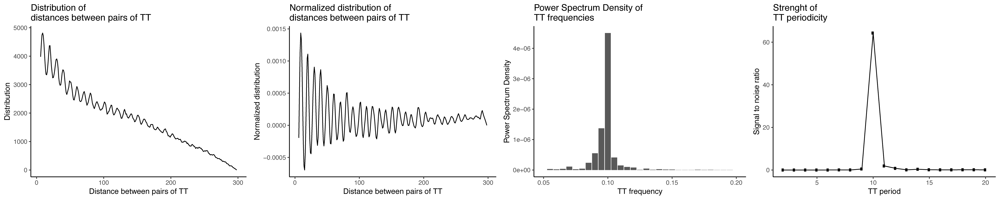

[](https://travis-ci.org/js2264/periodicDNA)
[](https://codecov.io/github/js2264/periodicDNA?branch=master)
[](https://www.tidyverse.org/lifecycle/#maturing)
[](https://github.com/js2264/periodicDNA)

# periodicDNA


## Introduction

This R package helps the user to identify very short sequences (e.g. di- or 
tri-nucleotides) present periodically in a set of genomic loci (typically 
regulatory elements). It is not aimed at identifying motifs separated by a 
conserved distance; for this type of analysis, please visit 
[MEME](http://meme-suite.org) website.

## Installation

periodicDNA can be installed from Github as follows:

```r
install.packages("devtools")
devtools::install_github("js2264/periodicDNA")
library(periodicDNA)
```

## Quick use

### Dinucleotide periodicity over a set of Genomic Ranges

`getPeriodicity()` is used to quantify the overall periodicity of a 
given motif over a set of genomic ranges.

```r
library(periodicDNA)
library(tidyverse)
data(proms)
periodicity_result <- getPeriodicity(
    proms,
    genome = 'ce11',
    motif = 'TT', 
    cores = 4
)
list_plots <- plotPeriodicityResults(periodicity_result) %>% 
    cowplot::plot_grid(plotlist = ., nrow = 1)
```



### Make track of periodicity over a set of Genomic Ranges

The other major use of this package is to generate specific tracks 
over a set of loci, e.g. the strength of WW 10-pb periodicity over promoters.  
**Important note:** We recommand to run this command across at least a dozen of
processors (use the `PROCS` argument). This command will take several hours and
possibly up to a day to run. It typically takes one day to produce a periodicity
track over 15,000 GRanges of 150 bp (with default parameters) using `PROCS = 12`.
We highly recommand the user to run this command in a new `screen` session. 

```r
data(ce_proms)
generatePeriodicityTrack(
    Biostrings::getSeq(
        BSgenome.Celegans.UCSC.ce11::BSgenome.Celegans.UCSC.ce11
    ),
    granges = ce_proms, 
    MOTIF = 'TT',
    FREQ = 1/10,
    PROCS = 12, 
    GENOME.WINDOW.SIZE = 100, 
    GENOME.WINDOW.SLIDING = 2, # can be 1 for single-base resolution
    BIN.WINDOW.SIZE = 60, # Set BIN.WINDOW.SIZE == GENOME.WINDOW.SIZE for no sliding window
    BIN.WINDOW.SLIDING = 5, 
    bw.file = 'TT-10-bp-periodicity_over-proms_gwin100_bwin60_bslide5.bw'
)
```

## Advanced use

Please read the [Introduction](vignettes/Introduction.md) vignette 
for a full presentation of the package functions.

## Contributions
Code contributions, bug reports, fixes and feature requests are most welcome.
Please make any pull requests against the master branch at 
https://github.com/js2264/periodicityDNA
and file issues at https://github.com/js2264/periodicityDNA/issues

## License 
**periodicDNA** is licensed under the MIT license.
