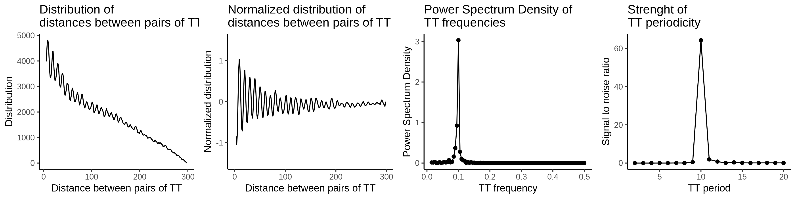
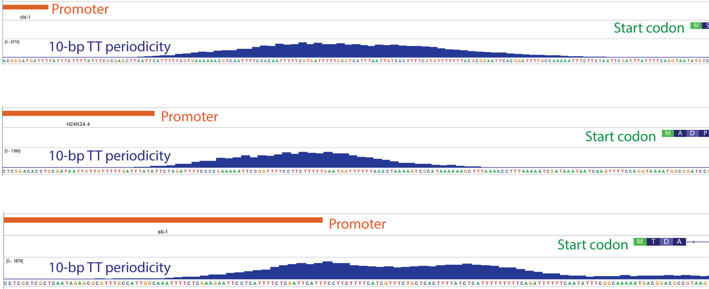

# Statement of Need

periodicDNA provides a framework to quantify oligonucleotide periodicity 
over individual or multiple DNA genomci loci. 

# Abstract
Many oligonucleotides are 
periodically occurring in genomes across eukaryotes, and some are impacting the 
physical properties of DNA. Notably, DNA bendability is modulated by 10-bp periodic 
occurrences of WW (W = A/T) dinucleotides. periodicDNA is an R package 
offering a set of functions to identify these local periodic elements 
in short sequences such as regulatory elements. It also provides a method 
to generate continuous tracks of oligonucleotide periodicity over genomic loci.
The use of periodicDNA has already shed light on fundamental differences 
in sequence features in functional classes of promoters. We hope that the 
integration of this open-source package into genomic analysis workflows 
will help further improve our understanding of chromatin organization. 

# Introduction


# Methods

## Implementation 
The package relies on Biostrings and BGenome packages to handle 
DNA sequences and genome assemblies. Genomic regions of interest should 
be imported with GenomicRanges to be analyzed by periodicDNA. To 
measure the periodicity of a given oligonucleotide in sets of sequences,
periodicDNA first map the oligonucleotide of interest in the sequences 
or genomic regions provided by the user then applies a Fast Fourier Transform
on the normalized distribution of oligonucleotide pairwise distances. 

## Operation

periodicDNA is distributed as an R package available on Github. 
Package dependencies and system requirements are documented here: https://js2264.github.io/periodicDNA/.
It is compatible with Mac OS X, Windows, and major Linux operating systems.  

### Installation

The package can be installed as follows: 

```r
devtools::install_github("js2264/periodicDNA")
```

### Calculating dinucleotide periodicity over a set of sequences

periodicDNA can be used to estimate the power spectral density (PSD) 
of a given dinucleotide (`motif` argument) at specific periods 
(`period` argument) in a set of sequences of interest (`seqs` argument), 
using `getPeriodicity()` function: 

```r
## Required libraries are loaded first
library(periodicDNA)
library(magrittr)
library(ggplot2)

## The periodicity can be calculated from DNAStringSet objects:
data(ce_proms_seqs)
ce_proms_seqs
score <- getPeriodicity(
    seqs = ce_proms_seqs, 
    motif = 'TT',
    cores = 4
)

## Alternatively, the periodicity can be calculated 
## from a GRanges object in combination with a genome.
## Here, we focus on forward ubiquitous promoters:
data(proms)
proms
score <- getPeriodicity(
    proms,
    genome = 'ce11', 
    motif = 'TT',
    cores = 120
)
```

Summary results can be plotted using the `plotPeriodicityResults()` function as follows (Figure 1):

```r
plots <- plotPeriodicityResults(score) %>% 
    cowplot::plot_grid(plotlist = ., nrow = 1)
```



The intermediate steps internally performed when calling `getPeriodicity()` are the following (Figure 2):

1. In each sequence of a set of n sequences (the `seqs` argument), all the pairs of the dinucleotide of interest (the `motif` argument, e.g. `TT`) are identified and their pairwise distances are measured.
2. The distribution of the all the resulting pairwise distances (also called "distogram") is generated.
3. The following normalization steps are then performed:
    (a) The distogram is transformed into a frequency histogram and then normalized by the following steps: 
    (b) The frequency histogram follows a marked overall decrease of frequencies with increased pairwise distances. Indeed, for a 200-bp long sequence containing 20 WW dinucleotides exactly distant from each other by 10 base pairs, there are 19 pairs with a pairwise distance of 10 but only 1 pair of dinucleotides with a pairwise distance of 190. To overcome this distance decay, the frequency histogram is smoothed using a moving average window of 10 and the resulting smoothed frequency histogram is substracted from the frequency histogram. This effectively transforms the decreasing frequency histogram into a dampened oscillating signal and improves the PSD estimation by Fourier Transform.
    (c) The dampened oscillating signal is then smoothed using a moving average window of 3. This effectively removes the effect of the latent 3-bp periodicity of most dinucleotides found in eukaryote genomes (@Gutierrez1994Apr). 
4. A Fast Fourier Transform (FFT) is then used to estimate the power spectral density (PSD) of the normalized oscillating distribution at different periods (the `period` argument).  


The PSD can be used in itself to identify which dinucleotide frequencies are enriched in the provided set of sequences. Its amplitude at a given frequency can also be used to compare dinucleotide frequencies across samples. 

### Generating tracks of dinucleotide periodicity
The other major function of periodicDNA is `generatePeriodicityTrack()`. Contrary to `getPeriodicity()` function which operates on a set of sequences to evaluate the overall periodicity of a given oligonucleotide, this function is used to generate linear genomic tracks (in .bigWig format) of oligonucleotide periodicity (Figure 3): 

```r
data(proms)
generatePeriodicityTrack(
    Biostrings::getSeq(
        BSgenome.Celegans.UCSC.ce11::BSgenome.Celegans.UCSC.ce11
    ),
    granges = proms, 
    MOTIF = 'TT',
    FREQ = 1/10,
    PROCS = 12, 
    GENOME.WINDOW.SIZE = 100, 
    GENOME.WINDOW.SLIDING = 2, 
    bw.file = 'TT-10-bp-periodicity-over-proms.bw'
)
```



**Important note:** It is recommended to run this command across at least a dozen of
processors (use the `PROCS` argument). This command will take several hours and
possibly up to a day to run. It typically takes one day to produce a periodicity
track over 15,000 GRanges of 150 bp (with default parameters) using `PROCS = 12`.
It is highly recommended to run this command in a new `screen` session. 

# Use case: leveraging periodicDNA to understand chromatin organization
Soon after solving the structure of nucleosomes, Kornberg raised a fundamental question: whether the positioning of nucleosomes in vivo in regard to a DNA locus was "specific" or "statistical" (@Kornberg1981-bi). Nucleosome "specific" positioning implies that the physicochemical properties of DNA sequences are enough to explain how nucleosomes are arranged along a DNA double-helix (e.g. described in @Segal2006-qb). On the contrary, a "statistical" positioning postulates the presence of a "boundary" nucleosome (either a protein or a strong intrinsic positioning sequence, or both) which specifies one end of a nucleosomal array not determined by the physicochemical properties of DNA sequence (e.g. described in @Mavrich2008-hn). Later on, biochemists, genomicists and computational biologists found out that periodic dinucleotide sequences were associated with positioned nucleosomes, suggesting that the "specific" model is contributing to nucleosome positioning - at least to a certain extent (@Jiang2009-zp; @Struhl2013-yx for review).  

To test whether specific periodic sequences were associated with the positioning of nucleosomes directly flanking regulatory elements, I leveraged periodicDNA, focusing on ubiquitous and tissues-specific promoters and enhancers. I first split each regulatory element into core (-70 to +70 base pairs around the center of the regulatory element), flanking (-210 to -70 base pairs and +70 to +210 base pairs) and distal sequences (-350 to -210 base pairs and +210 to +350 base pairs) (Figure 4A). I then calculated the TT 10-bp periodicity score over core, flanking and distal sequences of ubiquitous or tissue-specific promoters and enhancers.  
I first focused on promoters. periodicDNA results showed that ubiquitous and germline-specific promoters have a high TT 10-bp periodicity in the flanking sequences which largely decreases in the immediate neighboring distal sequences (Figure 4B). Such TT periodicity is absent in other tissue-specific promoters, as expected from previous results (Figure 4B and @Serizay2020Feb). These observations further support a sequence-specific model of nucleosome positioning, only at ubiquitous and germline-specific promoters (Figure 4C).
I then focused on enhancers. Interestingly, periodicDNA revealed that ubiquitous and germline enhancers have increased TT 10-bp periodicity in their flanking sequences as well as in their distal sequences (Figure 4B). The similarity of TT periodicity signal in the flanking and distal sequences of ubiquitous and germline enhancers suggest that nucleosomes may not be as positioned at these regulatory elements (Figure 4C).

![TT periodicity in promoters and enhancers. A- Pictogram representing how regulatory elements were divided into core, flanking and distal regions. The core sequence is the 140-bp long sequence at the center of the regulatory element; the flanking sequences range from -210 to -70 and from +70 to +210; the distal sequences range from -350 to -210 and from +210 to +350 (with the center of the regulatory element being the reference). B- TT 10-bp periodicity scores obtained from periodicDNA. C- Model of sequence-driven nucleosome positioning at different sets of promoters or enhancers. Three different situations are observed: (1) a decrease of TT periodicity on both sides of the flanking nucleosomes favors their precise positioning, (2) a weaker widespread TT periodicity favors nucleosome positioning without local enrichment and (3) absence of TT periodicity does not favor nucleosome positioning. Note that these models do not illustrate the role of other factors such as chromatin remodelers.](periodicityDNA_proms-enhs-core-flank-extended.png)

# Conclusion

# Acknowledgments
The work was supported by a Wellcome Trust Senior Research Fellowship to J.A. 
(101863) and a Medical Research Council DTP studentship to J.S..

# References
