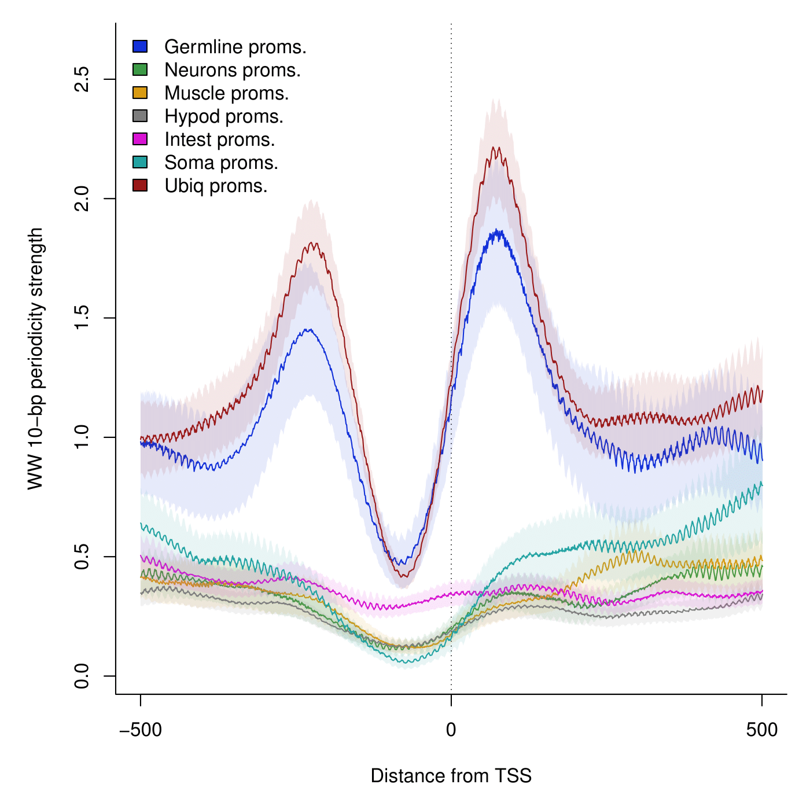
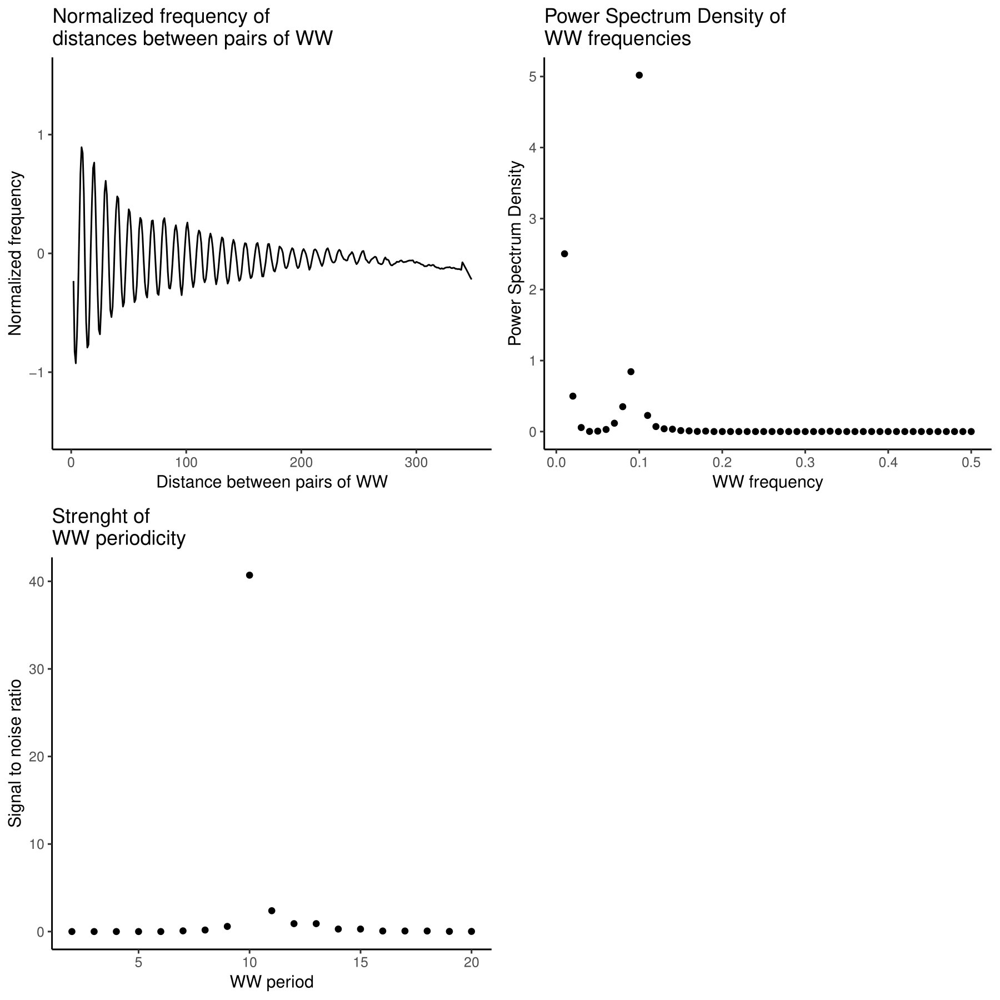
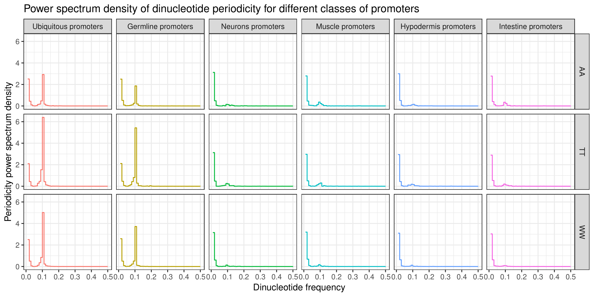

# perioDNA

**perioDNA is still in pre-Alpha and has not been thorouhly tested yet.  
Documentation will come soon.**



## Introduction

This package helps the user to identify very short sequences (e.g. di- or 
tri-nucleotides) present periodically in a set of genomic loci (typically 
regulatory elements). It is not aimed at identifying motifs separated by a 
conserved distance - for this analysis, please visit [MEME](http://meme-suite.org)
website.

## Installation

Most up-to-date version of perioDNA can be ran installed from Github as follow:

```r
    install.packages("devtools")
    devtools::install_github("js2264/perioDNA")
    library(perioDNA)
```

## Overview

To begin, a genome sequence and a set of genomic loci must be defined. Let's 
focus on the C. elegans genome for now, and more specifically around its TSSs. 

```r
    require(magrittr)
    ce_seq <- Biostrings::getSeq(BSgenome.Celegans.UCSC.ce11::BSgenome.Celegans.UCSC.ce11)
    ce_proms <- readRDS(url('http://ahringerlab.com/data/ce11_annotated_REs.rds')) %>% 
        '['(.$is.prom) %>% 
        deconvolveBidirectionalPromoters() %>% 
        AlignToTSS(50, 300) %>%
        withSeq(ce_seq)
```

### Dinucleotide periodicity over set of Genomic Ranges

Let's look at the WW 10-bp periodicity strength around ubiquitous promoters:

```r
    MOTIF <- 'WW'
    ubiq_WW <- getPeriodicity(ce_proms[ce_proms$which.tissues == 'Ubiq.'], motif = MOTIF, freq = 0.10, cores = 2)
    list_plots <- plotPeriodicityResults(ubiq_WW)
    ggsave(plot = cowplot::plot_grid(plotlist = list_plots), filename = 'examples/ubiquitous-promoters_WW-periodicity.pdf', width = 9, height = 9)
``` 



One can also perform the analysis of dinucleotides periodicity for multiple 
dinucleotides around several groups of promoters at once, as follows: 

```r
    require(ggplot2)
    list_proms <- list(
        "Ubiquitous promoters" =ce_proms[ce_proms$which.tissues == 'Ubiq.'],
        "Germline promoters" = ce_proms[ce_proms$which.tissues == 'Germline'], 
        "Neurons promoters" = ce_proms[ce_proms$which.tissues == 'Neurons'], 
        "Muscle promoters" = ce_proms[ce_proms$which.tissues == 'Muscle'], 
        "Hypodermis promoters" = ce_proms[ce_proms$which.tissues == 'Hypod.'], 
        "Intestine promoters" = ce_proms[ce_proms$which.tissues == 'Intest.']
    )
    list_motifs <- c('WW', 'AA', 'TT')
    list_periodicities <- lapply(list_motifs, function(MOTIF) {
        message('\t', MOTIF, ' periodicity...')
        lapply(list_proms, function(granges) {
            getPeriodicity(granges, MOTIF, freq = 0.10, cores = 2, verbose = FALSE)
        })
    }) %>% setNames(list_motifs)
    PSDs <- lapply(list_motifs, function(MOTIF) {
        PSDs <- lapply(list_periodicities[[MOTIF]], '[[', 'PSD') %>% namedListToLongFormat()
        PSDs$motif <- MOTIF
        return(PSDs)
    }) %>% do.call(rbind, .)
    plot <- ggplot(PSDs, aes(x = freq, y = PSD, color = name)) + 
        geom_step(stat = 'identity') +
        theme_bw() + 
        labs(
            x = 'Dinucleotide frequency', 
            y = 'Periodicity power spectrum density', 
            title = 'Power spectrum density of dinucleotide periodicity for different classes of promoters'
        ) + 
        facet_grid(motif~name) + 
        theme(legend.position = "none")
    ggsave('examples/dinucleotides-PSDs_WW-AA-TT.pdf', width = 10, height= 5)
```



### Track of dinucleotide periodicity

Another major use of this package is to generate specific tracks 
over a set of loci, e.g. the strength of WW 10-pb periodicity over promoters.  
**Important note:** We recommand to run this command across multiple processors
(specific by the `PROCS` argument). This command will take several hours and
possibly days to run. We highly recommand the user to run this command in a
new `screen` session. 

```r
    # This will generate a track of WW 10-bp periodicity over REs of chrV in ce11.
    ce_seq <- Biostrings::getSeq(BSgenome.Celegans.UCSC.ce11::BSgenome.Celegans.UCSC.ce11)
    ce_proms <- readRDS(url('http://ahringerlab.com/data/ce11_annotated_REs.rds')) %>% '['(.$is.prom) %>% '['(GenomicRanges::seqnames(.) == 'chrV')
    generatePeriodicityTrack(
        ce_seq,
        granges = ce_proms, 
        MOTIF = 'WW',
        FREQ = 1/10,
        bw.file = 'WW-10-bp-periodicity_over-proms-chrV.bw',
        PROCS = 100
    )
```

### Plotting results

One can use the convenient plotting function to investigate the resulting track. 
For instance, we can look at the strength of periodicity over different classes 
of tissue-specific promoters. 

```r
    periodicity_track <- list(
        rtracklayer::import.bw(
            '20190327_dinuc-periodicity_final-REs/WW-periodicity-enrich_spec.mtm_g-250^2_b-100^10.bw',
            as = 'Rle'
        ) %>% scaleBigWigs()
    )
    ce_proms <- readRDS(
        url(
            'http://ahringerlab.com/data/ce11_annotated_REs.rds')
        ) %>% 
            '['(.$is.prom) %>% 
            '['(GenomicRanges::seqnames(.) == 'chrV')
    granges_list <- lapply(
        c("Ubiq.", "Germline", "Neurons", "Muscle", "Hypod.", "Intest."),
        function(TISSUE) {
            AlignToTSS(
                ce_proms[ce_proms$which.tissues == TISSUE], 
                upstream = 500, 
                downstream = 500
            )
        }
    ) %>% setNames(
        paste0(
            c("Ubiq", "Germline", "Neurons", "Muscle", "Hypod", "Intest"),
            ' proms.')
        )
    p <- plotAggregateCoverage(
        granges_list, 
        periodicity_track, 
        list.COL = c("#991919", "#1232D9", "#3B9B46", "#D99B12", "#7e7e7e", "#D912D4"), 
        YLAB = 'WW 10-bp periodicity strength', 
        XLAB = 'Distance from TSS', 
        verbose = T,
        auto.scale = c(0.075, 0.925), 
        BIN = 1,
        plot.legend = TRUE,
        by.granges = FALSE
    )
    ggsave('examples/W-10bp-periodicity_tissue-spe-TSS.pdf')
```


This clearly highlights the increase of WW 10-bp periodicity immediately 
downstream of ubiquitous and germline promoters, while it is 
inexistent downstream of other TSSs.